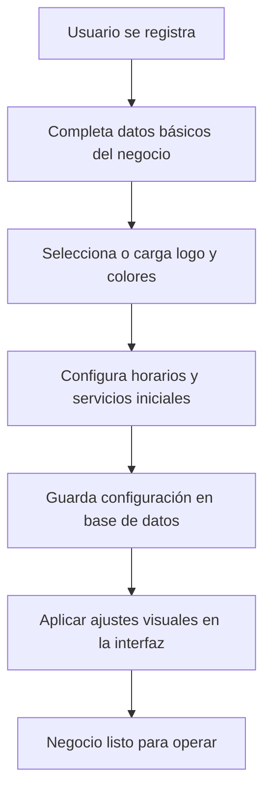
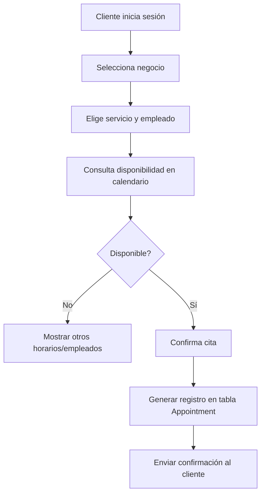
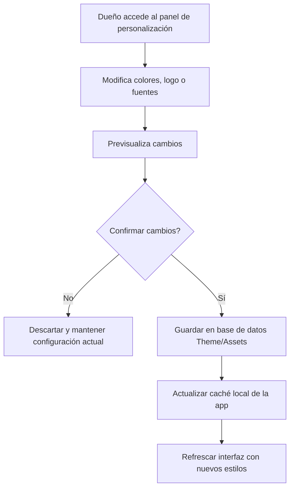
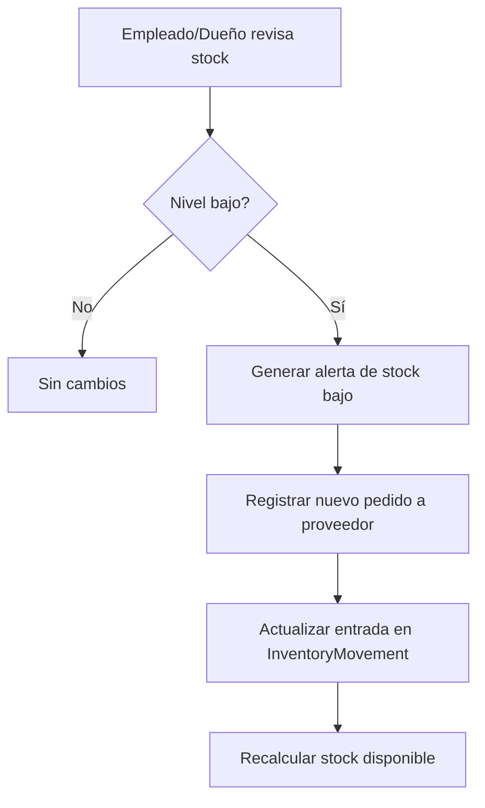
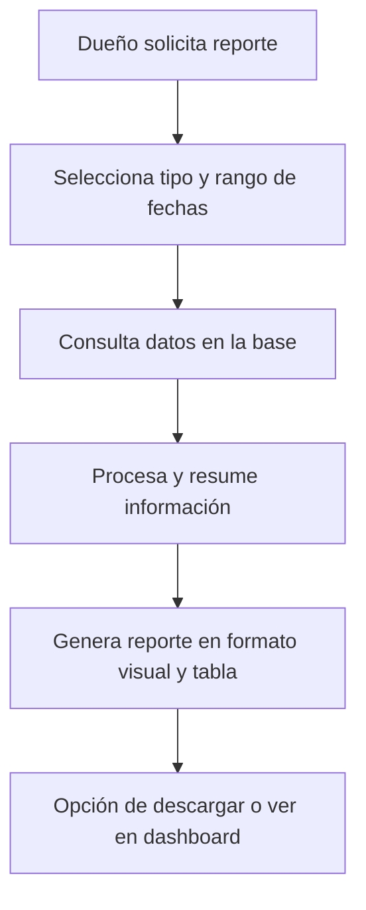

Aquí Está el **README conceptual** que documenta la **lógica de negocio** y recoge recomendaciones estratégicas para que la plataforma sea clara, cómoda y atractiva para el usuario final. No habla de tecnologías, solo de cómo debe funcionar la experiencia y el flujo interno.

---

# 📖 README - Lógica de Negocio de la Plataforma

## 1. 🎯 Propósito
Una plataforma multi–negocio que permita a sus dueños personalizar por completo la apariencia y la configuración, optimizar procesos internos y ofrecer una experiencia fluida a clientes y empleados.

---

## 2. 🧩 Principios Clave
- **Personalización total**: Cada negocio debe poder ajustar la estética y la lógica operativa sin depender del equipo de desarrollo.
- **Estructura modular**: Dividir la lógica en módulos independientes (citas, inventario, reportes, etc.) para escalar y adaptarse a distintos giros.
- **Experiencia centrada en el rol**: Adaptar vistas y funciones según si es dueño, empleado o cliente.
- **Consistencia visual**: Mantener un diseño coherente aunque cada negocio use sus propios colores y estilos.

---

## 3. 📚 Flujo General de Negocio

1. **Registro y configuración inicial**  
   - Alta del negocio con datos básicos.  
   - Selección o carga de logo, colores y estilo.  
   - Configuración de horarios, servicios y precios.

2. **Gestión diaria**  
   - **Dueño/Admin**: supervisa agenda, inventario, personal y reportes.  
   - **Empleado**: atiende citas, gestiona pedidos o ventas.  
   - **Cliente**: agenda, cancela o reprograma citas, ve promociones.

3. **Actualización en tiempo real**  
   - Cambios en la configuración visual y operativa reflejados al instante.  
   - Sincronización entre panel administrativo y app de cliente.

4. **Retroalimentación**  
   - Encuestas de satisfacción tras cada cita o compra.  
   - Reportes automáticos sobre uso de funciones y preferencias del cliente.

---

## 4. 🎨 Personalización y Usabilidad

- **Diseño adaptable**: Permitir elegir entre varias disposiciones (menú lateral, superior, tarjetas) y tipografías.  
- **Colores y branding** desde base de datos: lectura al inicio y almacenamiento en caché local para que la app funcione igual sin conexión.  
- **Previsualización**: Antes de guardar cambios de diseño, mostrar cómo lucirá la app.  
- **Modo oscuro/claro** configurable por negocio o usuario.

---

## 5. 🗂 Gestión de Datos y Roles

- **Separar datos sensibles** del cliente y de la empresa para proteger la privacidad.  
- **Roles claros y permisos granulares**: Un empleado de caja no ve reportes financieros, pero sí inventario.  
- **Historial de acciones (auditoría)**: Que el dueño pueda ver quién hizo cada cambio.

---

## 6. 📅 Lógica de Citas y Servicios

- **Prevención de choques**: Al agendar, el sistema verifica disponibilidad de recurso (empleado/silla/mesa).  
- **Recordatorios automáticos** por notificación o correo antes de la cita.  
- **Políticas flexibles**: Definir tiempos de cancelación, pagos anticipados y penalizaciones.

---

## 7. 📦 Lógica de Inventario

- Control de entradas y salidas con motivo (venta, desperdicio, ajuste).  
- Alertas de bajo stock configurables por cada negocio.  
- Registro histórico para análisis de consumo.

---

## 8. 📊 Lógica de Reportes

- **Reportes automáticos programados**: resumen semanal/mensual.  
- **Filtros dinámicos**: por fechas, empleados, categoría de servicio.  
- **Indicadores clave** visibles en el dashboard (ocupación, ingresos, satisfacción).

---

## 9. 💬 Experiencia del Usuario Final

- **Flujos simples**: Un cliente debe poder agendar en 3 toques máximo.  
- **Lenguaje claro**: Evitar términos técnicos, usar expresiones cercanas al sector (ej. “Reservar cita” en vez de “Generar evento”).  
- **Tiempo de carga mínimo**: Que la interfaz responda rápido incluso con mucha información.  
- **Asistente dentro de la app**: Guías paso a paso para usuarios nuevos.

---

## 10. 🌟 Extras que potencian la comodidad

- **Programas de fidelización** (puntos, descuentos).  
- **Promociones personalizadas** según historial del cliente.  
- **Panel multi–negocio** para dueños con varias sucursales.  
- **Historial personal del cliente** con fotos o notas (p.ej. “Color aplicado en visita anterior”).

---

## 11. ✅ Recomendaciones Finales
1. Siempre permitir **deshacer cambios recientes** para evitar errores.  
2. Dar **control total al dueño** sobre textos, imágenes y estilos.  
3. Incorporar métricas de **uso de funciones** para mejorar la experiencia.  
4. Mantener **coherencia visual** con el branding del cliente.  
5. Simplificar la navegación para que incluso usuarios no técnicos la usen sin problemas.

### Diagramas de Flujo de Negocio ###

¡Vamos a ponerlo visual! 📊  
Aqui estan algunos **diagramas de flujo de procesos clave** que representen la lógica de negocio que definimos, usando un formato claro y fácil de entender. Esto servirá para una buena documentación y para que cualquier miembro del equipo comprenda el funcionamiento interno sin leer párrafos enteros.

---

## 1️⃣ Flujo: **Registro y Configuración Inicial del Negocio**

---

## 2️⃣ Flujo: **Agendamiento de Citas**

---

## 3️⃣ Flujo: **Cambio de Diseño por el Dueño**

---

## 4️⃣ Flujo: **Control de Inventario**

---

## 5️⃣ Flujo: **Generación de Reportes**

---

💡 **Recomendación para tu documentación**  
Puedes usar estos diagramas como base y ampliar cada uno con notas sobre **reglas de negocio**, por ejemplo:  
- Límite de citas por empleado/día.  
- Tiempo de antelación mínima para reservar.  
- Colores y logos almacenados siempre por `business_id`.  
- Inventario con umbral configurable.

---

Si quieres, en el próximo paso puedo hacer **un diagrama Entidad–Relación (ER)** completo con todas las tablas que definimos antes, para que tu equipo lo use como blueprint técnico definitivo.